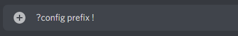

# Configuration

## Configuration de Base

Une fois que le Bot est invité sur votre serveur, vous pouvez configurer quelques options avec la commande ?config:

*   `?config prefix <NouveauPrefix>`

    ````

    Après `?config prefix`, entrez le préfix que vous souaithez utiliser. Les commandes devront ensuite obligatoirement commencer par le préfix choisi.
*   `?config welcomMessage <NouveauMessage>`

    ``.png>)``

    Après `?config welcomeMessage`, entrez le message que recevront en privé vos nouveaux utilisateurs à leur arrivé sur le serveur.

    Vous pouvez utiliser des variables dynamiques qui se modifieront selon les paramètres de votre serveur:

    `{{user}}`: Pseudonyme de l'utilisateur

    `{{server}}`: Nom de votre serveur

## Panneau de configuration

Vous pouvez accéder à votre panneau de configuration e ligne en cliquant [ici](https://pixelbot.tk/dashboard). Cela vous permet pour le moment de désactiver ou activer certaines catégories de modules, mais deviendra très bientôt plus complet avec de nouvelles fonctionnalités.

.png>)

